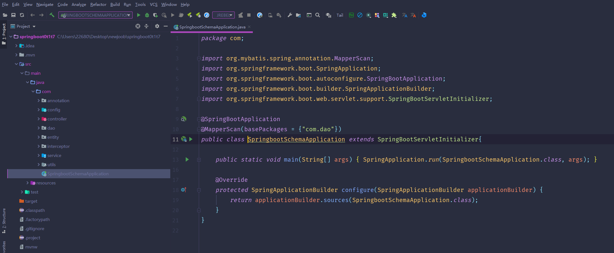
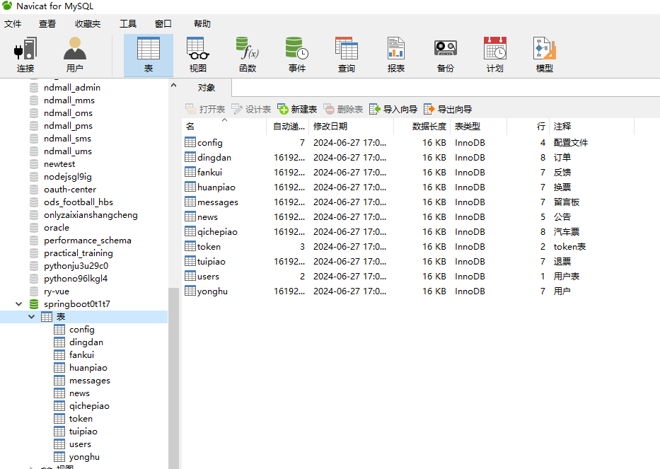
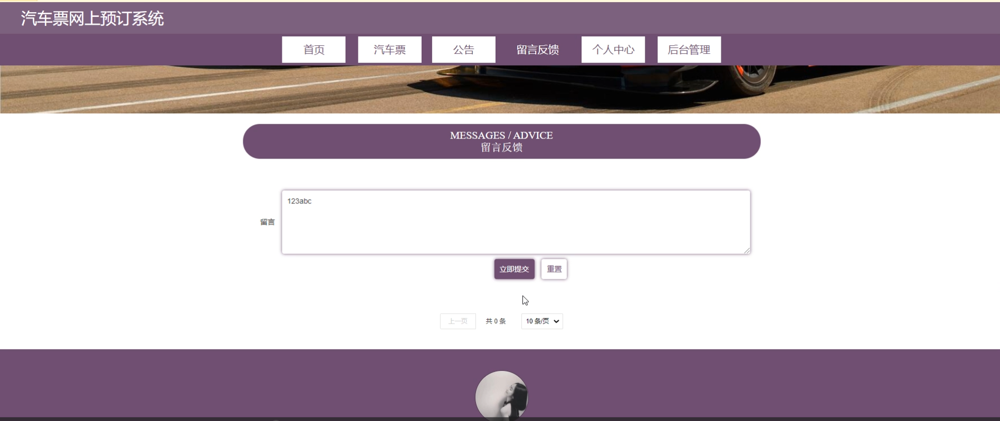
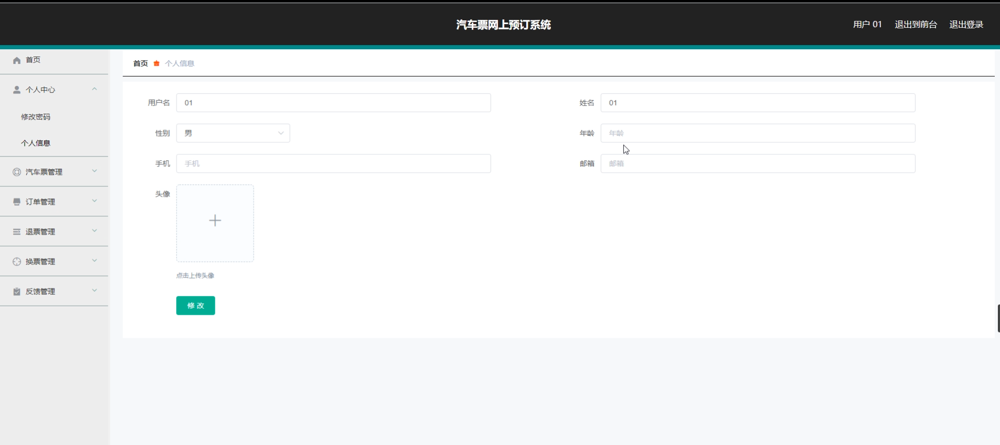
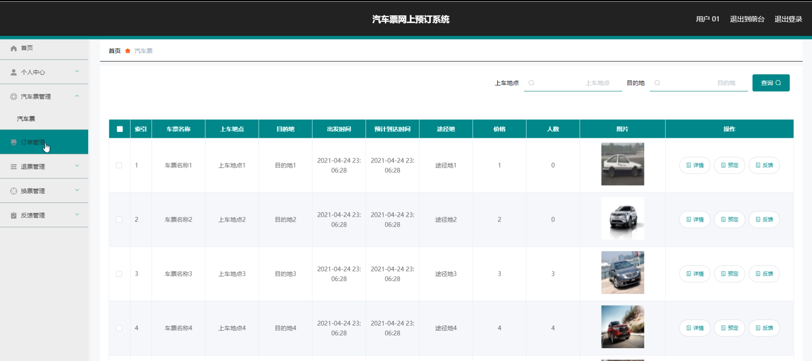
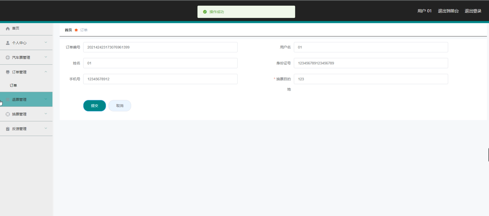
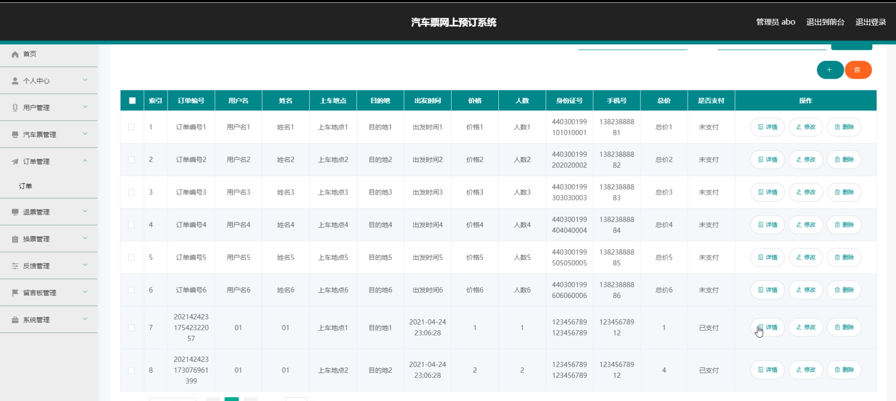
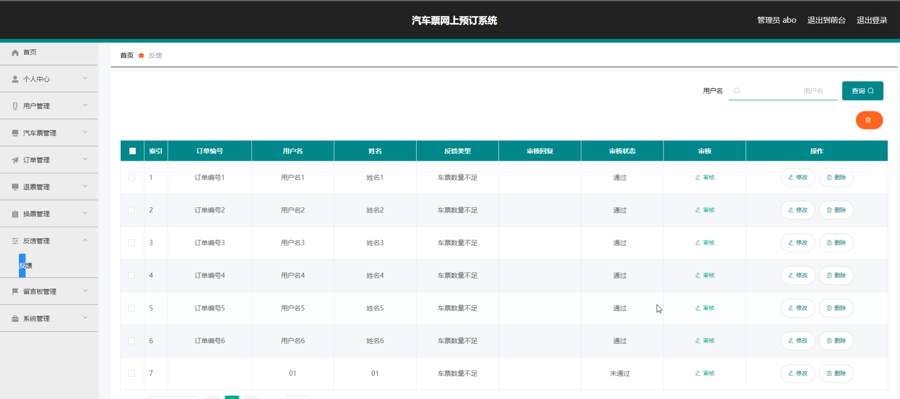
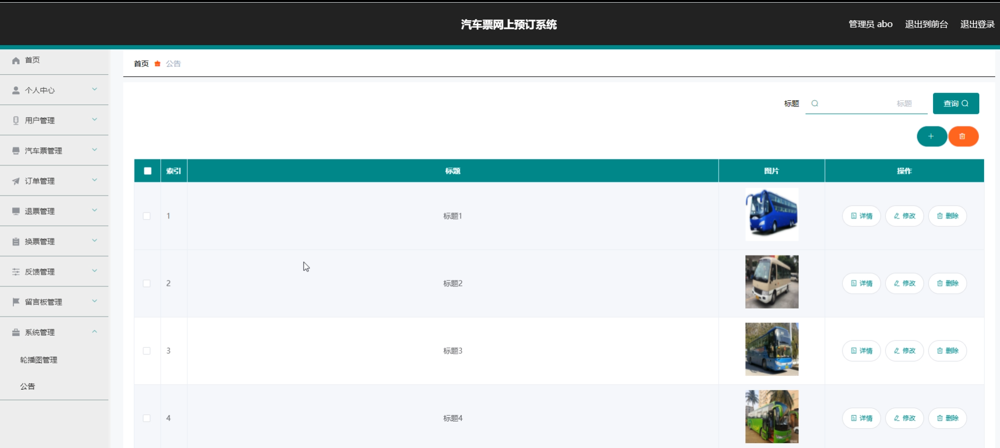

# 基于SpringBoot的汽车票网上预订系统

<h4 style='color:red'>联系不到我，就看我的主页 </h4> 
 
#### 介绍

随着互联网技术的不断发展和人们出行需求的日益增长，汽车票网上预订系统成为了便捷出行的重要工具。本基于 Spring Boot 的汽车票网上预订系统旨在为用户提供高效、便捷、安全的汽车票预订服务，同时为管理员提供全面、有效的管理功能，以提升整个票务服务的质量和效率。

#### 技术栈

后端技术栈：Springboot+Mysql+Maven

前端技术栈：Vue+Html+Css+Javascript+ElementUI

开发工具：Idea+Vscode+Navicate

#### 系统功能介绍

（一）管理员角色  
个人中心：查看和修改个人信息，接收系统通知和重要消息。  
用户管理：审核新用户注册，管理用户账户信息，包括权限设置、信息修改等。  
汽车票管理：添加、编辑和删除汽车票信息，包括车次、出发地、目的地、发车时间、票价等。  
订单管理：查看所有订单详情，跟踪订单状态，处理异常订单。  
退票管理：处理用户的退票申请，按照规定进行退票操作和费用核算。  
换票管理：处理用户的换票请求，协调相关车次和座位的调整。    
反馈管理：收集和处理用户的反馈信息，及时改进服务质量。  
留言板管理：审核和回复用户在留言板上的留言，与用户进行沟通交流。  
系统管理：进行系统的参数配置、数据备份与恢复、安全设置等操作。  

（二）用户角色  
汽车票：查询符合需求的汽车票信息，包括车次、时间、票价、余票等。  
公告：查看系统发布的重要通知、车次调整信息、优惠活动等。  
留言反馈：向管理员提出意见和建议，反馈使用过程中的问题。  
个人中心：修改个人资料、密码，查看订单历史和购票记录。  
后台管理  
汽车票管理：查看已预订的汽车票详情。  
订单管理：查看订单状态，进行订单支付、取消等操作。  
退票管理：提交退票申请，查看退票进度。  
换票管理：提交换票申请，查看换票处理结果。  
反馈管理：查看自己提交的反馈处理情况。  

#### 系统作用

1.提升购票效率  
用户无需前往售票窗口，随时随地通过网络即可预订汽车票，节省时间和精力。  
管理员能够快速处理票务信息，减少人工操作的繁琐和错误。  
2.优化服务质量  
用户可以通过反馈和留言与管理员沟通，促使服务不断改进。  
管理员根据用户需求合理调整车次和票价，提升用户满意度。  
3.增强管理能力  
管理员全面掌握票务销售、用户信息和订单情况，便于进行数据分析和决策。  
有效处理退票、换票等特殊情况，保障票务运营的有序进行。  
4.提供便捷信息获取  
用户及时了解车次动态和公告信息，合理安排出行计划。  
管理员通过系统获取用户需求和市场趋势，为运营策略提供依据。  

#### 系统功能截图

代码结构

数据库表

登录

前台页面首页

汽车票

留言反馈

用户端后台管理

汽车票股管理

订单管理

管理员端订单管理

反馈管理

系统管理

#### 总结

本基于 Spring Boot 的汽车票网上预订系统，通过明确的角色划分和丰富的功能模块，为用户提供了便捷的购票体验，为管理员提供了高效的管理手段。系统不仅满足了用户的出行需求，也提升了汽车票务服务的整体水平。未来，随着技术的持续创新和用户需求的变化，系统将不断优化和完善，为人们的出行带来更多便利。

#### 使用说明

创建数据库，执行数据库脚本 修改jdbc数据库连接参数 下载安装maven依赖jar 启动idea中的springboot项目

后台地址：http://localhost:8080/springboot0t1t7/admin/dist/index.html

管理员  abo 密码 abo

前台地址：http://localhost:8080/springboot0t1t7/front/index.html

